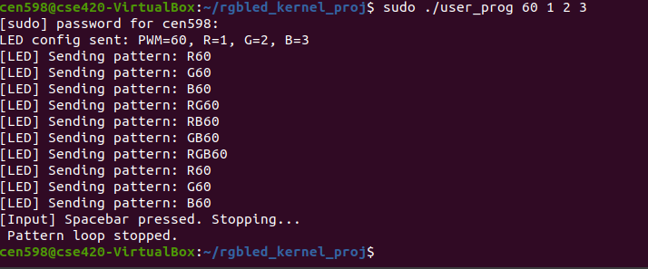
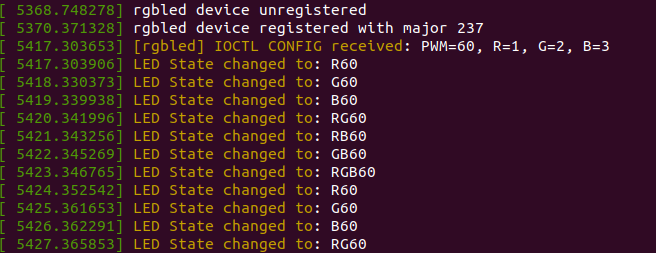

# Custom Linux Kernel Module – Simulated RGB LED Driver

This project demonstrates a complete Linux kernel module and user-space program for simulating RGB LED control via a character device. It is adapted from a real hardware-based Intel Galileo GPIO project and recreated entirely inside a Linux VirtualBox environment — enabling GPIO/PWM simulation without physical hardware.

---

## Features

-  Loadable Linux kernel module (`rgb_led.ko`)
-  Character device `/dev/rgbled` for user-kernel communication
- `ioctl()` interface to configure:
-  PWM intensity (0–100%)
-  Red, Green, and Blue pin numbers
- `write()` interface to send LED pattern strings (`R60`, `RGB40`, etc.)
-  Multithreaded user-space control with `pthread`
-  Spacebar-based graceful termination using `/dev/input/eventX`
-  Kernel logging viewable through `dmesg`

---

## Project Structure
```
custom-linux-kernel-module/
├── Makefile # Kernel module build script
├── rgb_led.c # Kernel module source
├── user_prog.c # User-space control application
├── led_ioctl.h # Shared ioctl struct definitions
├── .gitignore
└── README.md 
```
---

## Build & Run Instructions

### 1. Build the Kernel Module

```
make
```

### 2. Insert the Kernel Module

```
sudo insmod rgb_led.ko
```

Check logs using:
```
dmesg | grep rgbled
```

### 3. Create the Device Node

```
sudo mknod /dev/rgbled c <major_number> 0
sudo chmod 666 /dev/rgbled

Replace <major_number> with the number shown in dmesg after inserting the module.
```
### 4. Compile the User Program
```
gcc user_prog.c -o user_prog -lpthread
```

### 5. Run the Program
```
sudo ./user_prog <PWM> <R_pin> <G_pin> <B_pin>
```
Example:
```
sudo ./user_prog 60 1 2 3
```


### Kernel Log Output



### 

### Tested Environment
```
Ubuntu 20.04.6 LTS (64-bit) in VirtualBox

Linux Kernel 5.15+

GCC, Make

evtest used to confirm /dev/input/eventX
```